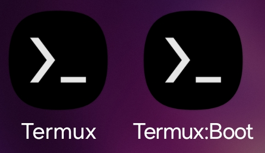
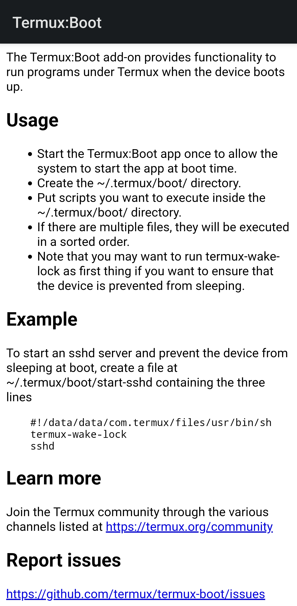
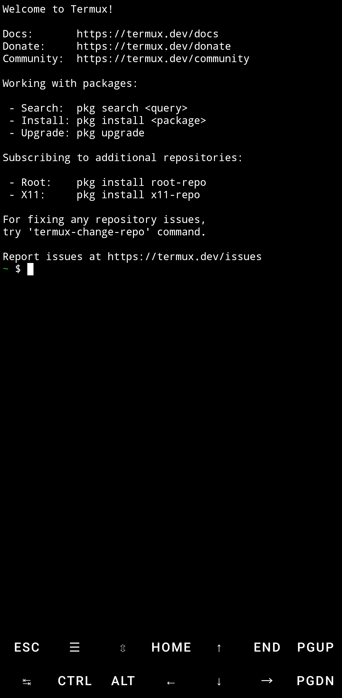
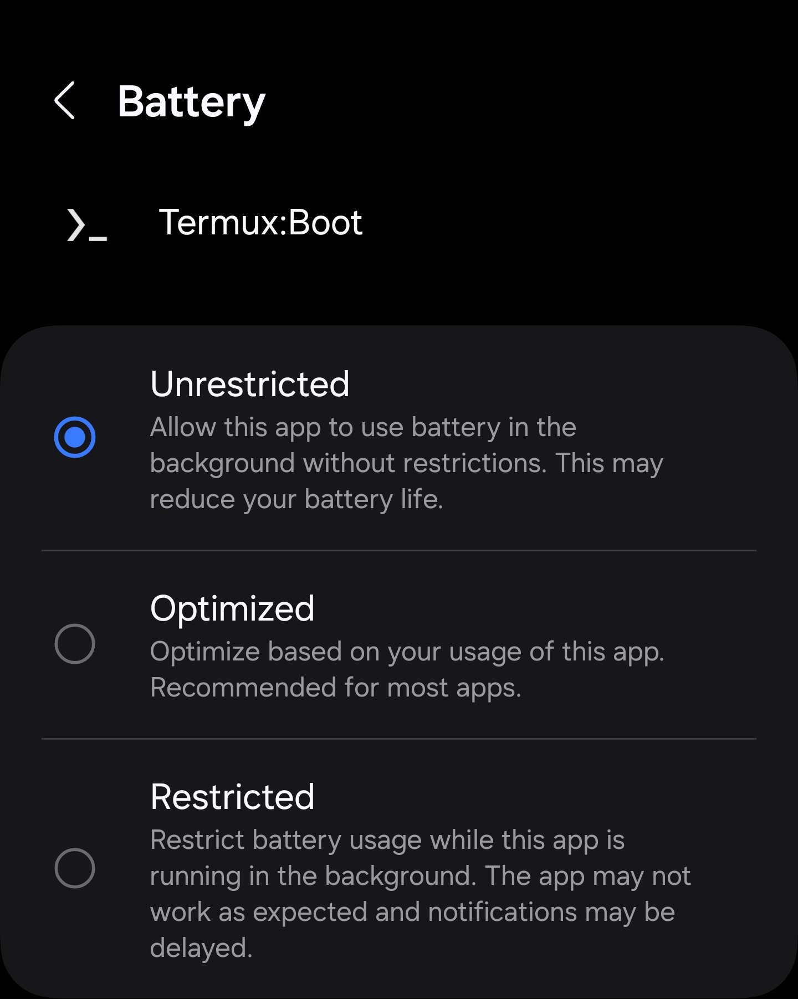

# This is a repository to utilize Termux & Termux-Boot.
## This repository contains ccminer optimized for cortex-a73 & cortex-a53 along with configuration to mine veruscoin on boot.


1. Download & Install: Termux & Termux-Boot:
   [Termux](https://github.com/termux/termux-app/releases/download/v0.119.0-beta.1/termux-app_v0.119.0-beta.1+apt-android-7-github-debug_arm64-v8a.apk)
   [Termux-Boot](https://github.com/termux/termux-boot/releases/download/v0.8.1/termux-boot-app_v0.8.1+github.debug.apk)
   

3. Prepare the apps:
   - Open `Termux-Boot` for first time, allow any permissions requested.
   
   - Then open `Termux` for first time, allow any permissions requested.
   
   - Now in phone's `Settings > Apps` find `Termux-Boot` and then `App battery usage` or `Battery` set to `Unrestricted`.
   
   - Now repeat step above for the app `Termux` aswell.
   

5. Edit your config.json and then this readme to include your own fork.

6. Now open `Termux` and run the installer with:
```
curl -o- -k https://raw.githubusercontent.com/Darktron/tboot/main/install.sh | bash && cd ~/ccminer
```
7. When the intallation is complete then can reboot.
